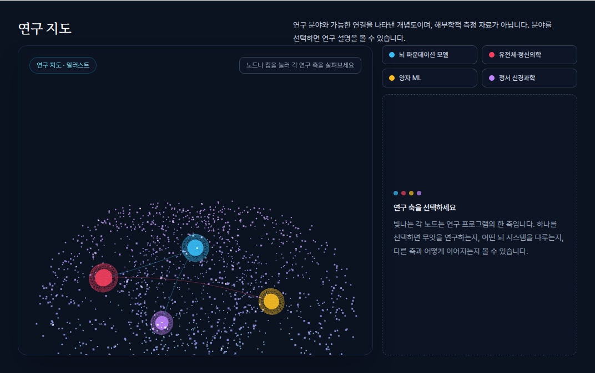
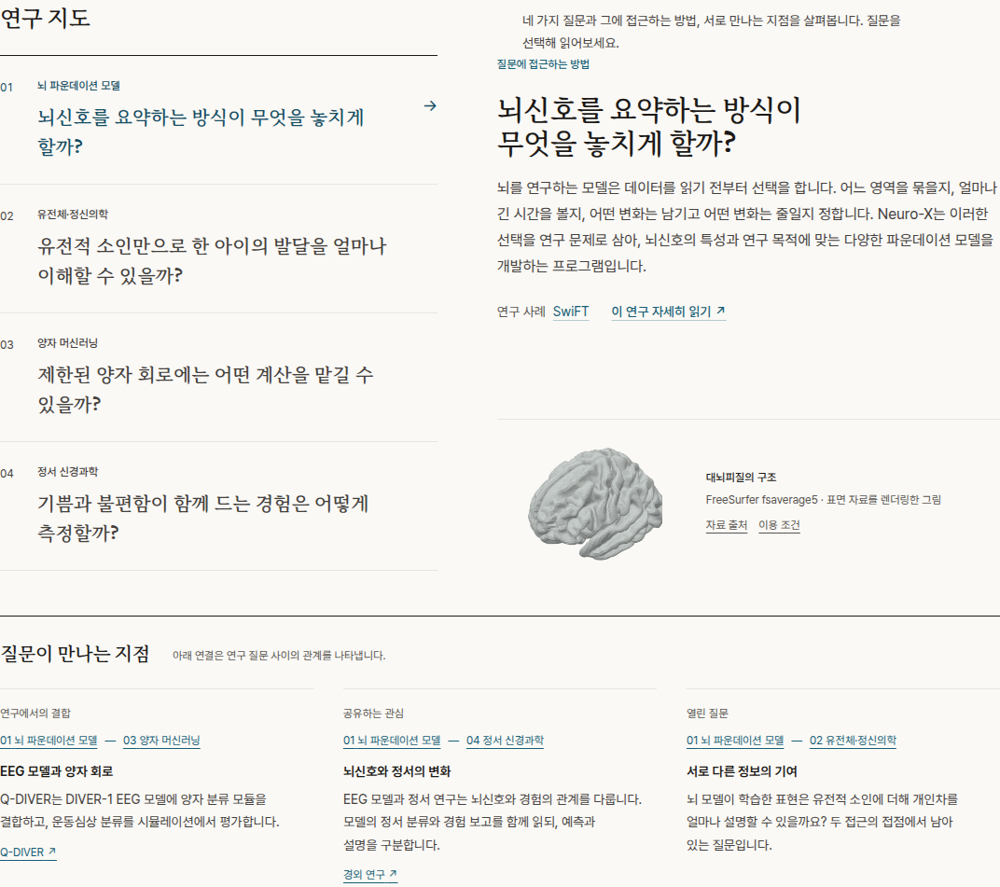
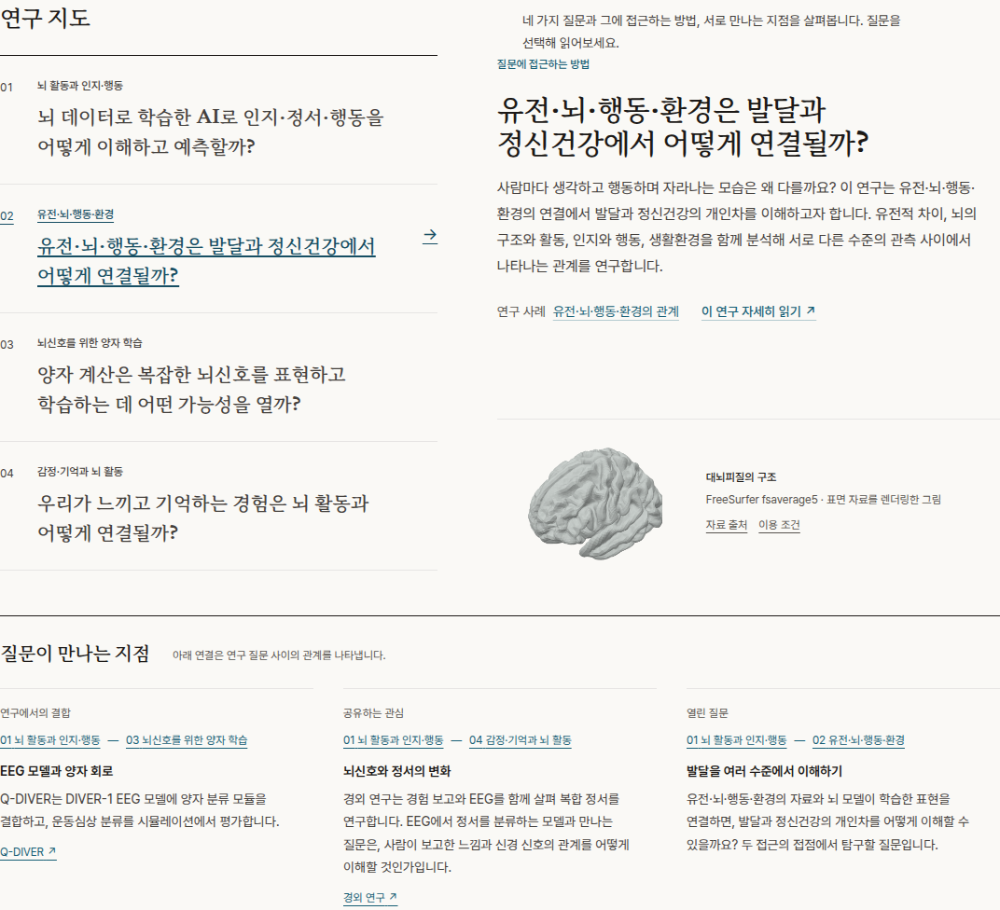
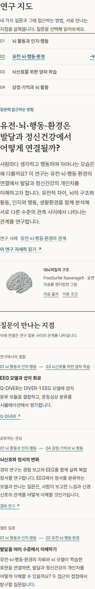

# 연구 지도: 화면 진단과 개선 방향

2026-09-13 · 현재 작업 트리의 한국어 `/research` 로컬 미리보기 기준

**권고: 네 연구 질문을 읽고 비교할 수 있는 연구 아틀라스로 재구성한다.** 현재 홈페이지의 종이색·잉크색·청록과 서체를 이어 쓰고, 뇌 형상을 유지할 경우에는 출처가 확인된 피질 표면을 사용한다. 연구 분야를 뇌 안의 임의 좌표에 놓는 방식은 바꾼다.

최초 결과물은 디자인 검토였다. 이후 사용자가 계획 평가·보완, TDD 구현, 최종 재평가와 추가 수정을 승인했다. 아래 실행 기록에 현재 상태를 남긴다. 이전에 완료한 철학·미션 개편의 로컬 변경은 보존한다.

## 실제로 확인한 문제



| 문제 | 확인한 근거 | 방문자에게 미치는 영향 |
|---|---|---|
| 형상이 아래로 잘린다 | 카메라 높이는 `y=1.5`, 형상 중심은 `y=0.2`. 카메라가 중심을 바라보도록 설정하는 코드가 없다 | 위는 비고 아래는 잘려, 의도한 구도로 보이지 않는다 |
| 뇌의 구조가 불분명하다 | 두 타원체에 무작위 점 1,600개를 배치한 형상. 피질 표면 에셋이 없다 | 신경과학의 구체적인 대상을 보여주기보다 일반적인 기술 시연처럼 보인다 |
| 홈페이지와 시각 언어가 다르다 | 짙은 남색 박스, 네 가지 고채도 색, 발광 구체, 그림자, 둥근 패널 | 앞서 읽던 차분한 연구 소개에서 별개의 위젯으로 넘어간 느낌을 준다 |
| 처음에는 내용이 부족하고, 선택 뒤에는 과밀하다 | 초기에는 빈 안내 패널. 선택하면 설명·뇌 시스템·성과 목록·연결된 축·버튼이 한꺼번에 등장 | 첫 진입 때 배울 것이 적고, 선택 뒤에는 좁은 열에서 긴 글을 읽어야 한다 |
| 지도의 기능이 불분명하다 | 바로 앞에 같은 네 분야의 목차가 있고, 지도 노드에는 직접 읽을 수 있는 분야명이 없다 | 그림이 추가로 무엇을 설명하는지 알기 어렵다 |
| 선과 위치가 의미를 과장할 수 있다 | 노드 좌표는 수동 배치. 선에는 공유 질문과 아직 입증되지 않은 연결 가능성이 섞여 있다 | 연구 분야에 해당하는 뇌 위치나 실제 신경 연결로 오해할 여지가 있다 |

### 잘림의 기술적 원인

- [BrainCanvas.tsx](../src/components/3d/BrainCanvas.tsx), 45–51행: 원근 카메라 위치만 지정하고 `lookAt`은 호출하지 않는다. 기본 시선이 형상의 중심을 벗어난다.
- 같은 파일 70–105행: 형상은 두 타원체의 점구름이다. 카메라 조정만으로 해부학적인 디테일이 생기지는 않는다.
- 같은 파일의 `onResize`: 종횡비만 갱신한다. 화면 폭에 맞춰 카메라 거리나 구도를 다시 맞추지 않는다.
- [BrainViewer.tsx](../src/components/3d/BrainViewer.tsx), 187–188행: 데스크톱에서는 오른쪽 패널이 22rem을 차지하고, 캔버스 높이는 구간별 고정값이다. 좁은 화면의 수평 시야도 별도로 고려해야 한다.

읽기 전담 조사자가 설치된 Three.js로 카메라 투영을 재현했다. 높이 560px일 때 형상 중심이 화면의 약 440px에, 생성식에 들어맞는 하단 전면 점이 약 635px에 놓였다. 정서 신경과학 노드도 반 바퀴 회전하면 약 626px에 놓일 수 있었다. 이 수치는 코드의 투영 실험이며, 아래 브라우저 측정과 구분한다. 단순히 `overflow-hidden`을 없애도 WebGL 화면 밖으로 투영된 부분은 돌아오지 않는다.

### 브라우저 측정

Playwright Chromium, 한국어, `reduced-motion: reduce`. 같은 Neuro-X 분야를 선택한 상태의 지도 구획 전체 높이. 좌표는 레이아웃 측정이며 형상의 경계 측정은 아니다.

| 화면 너비 | 실제 캔버스 크기 | 선택 후 지도 구획 높이 |
|---:|---:|---:|
| 1,440px | 638 × 558px | 965px |
| 900px | 770 × 558px | 1,343.5px |
| 390px | 308 × 418px | 1,518px |

[측정 원본](assets/research-map-review-2026-09-13/dimensions.json) · [모바일 캔버스](assets/research-map-review-2026-09-13/mobile-canvas.png)

## 권장 구성

지도에서 방문자가 얻을 것은 세 가지다. **어떤 질문을 연구하는지, 무엇으로 조사하는지, 다른 질문과 어떤 관계가 있는지.** 뇌를 회전시키는 행동 자체가 중심 기능이 되지 않도록 한다.

### 1. 질문이 보이는 목록과 짧은 설명을 한 화면에 둔다

- 연구 페이지 상단의 분야 목차와 지도 선택기를 하나로 통합한다. 기존 분야 ID·상세 페이지 링크·본문 앵커는 유지한다.
- 네 분야를 작은 색상 칩 대신 번호와 이름이 있는 목록으로 표시한다. 분야별 질문은 현재 콘텐츠 컬렉션의 `question`을 사용한다.
- 첫 번째 분야의 질문과 설명이 처음부터 보이게 한다. 큰 빈 안내 패널을 없앤다.
- 선택 시 질문, 접근 방식 2–3문장, 대표 연구 링크 하나를 보여준다. 전체 성과 목록과 긴 설명은 이미 있는 상세 페이지로 연결한다.
- 연결 설명은 별도 짧은 행으로 둔다. 무엇을 공유하는지 문장으로 읽을 수 있어야 한다. 아직 입증되지 않은 가능성에는 그 상태를 명시한다.
- 기존 연결 세 개를 그대로 옮기는 것으로 끝내지 않는다. 어떤 연결을 넣고 뺐는지 기존 연구 검토 자료와 대조한다. 독립 검토에서도 실제 피질 표면보다 연결의 선정·근거·읽히는 설명이 우선이라는 지적이 나왔다. 관계를 설명할 수 없다면 선을 추가하지 않는다.

배치 개념은 다음과 같다. 고정 좌표나 최종 시안이 아니라 정보의 우선순위를 나타낸다.

```text
연구 지도                         네 질문과 연구의 접근 방식
──────────────────────────────────────────────────────────
01 뇌 파운데이션 모델              선택한 분야의 질문
02 유전체·정신의학                  접근 방식 2–3문장
03 양자 머신러닝                    대표 연구 · 자세히 읽기
04 정서 신경과학
                                   연결된 질문과 그 이유
                                   공유하는 접근 / 열린 질문
──────────────────────────────────────────────────────────
실제 뇌 표면 또는 연구 그림은 이 내용과 함께 배치하되,
그림의 출처와 의미를 짧은 캡션으로 설명한다.
```

현재 문안의 예: **“뇌신호를 요약하는 방식이 무엇을 놓치게 할까?”** 선택 시 기술 이름부터 열거하기보다, 이 질문과 해당 분야의 검토된 접근 설명을 먼저 보여준다. 홈페이지에서 정리한 철학이 지도 안에서도 이어진다.

### 2. 뇌를 쓴다면 형상과 의미를 함께 정리한다

뇌는 유지할 수 있다. 다만 **검증된 표면을 쓴다는 사실만으로 연구 관계가 설명되지는 않는다.** 실제 피질의 굴곡을 읽을 수 있는 절제된 표면을 쓰고, 연구 질문의 연결은 별도의 글과 도식으로 설명한다.

- 밝은 회백색의 무광 표면, 부드러운 음영, 정지된 사선 시점을 기본으로 한다. 발광 점구름·맥동·자동 회전은 제거하는 방향을 권한다.
- 사용자가 원할 때만 회전할 수 있게 하고, 원래 시점으로 돌아가는 제어를 제공한다. 3D 회전이 독해에 도움이 없다면 정적 렌더링으로 충분하다.
- 네 분야는 뇌 바깥의 목록에서 선택한다. QML이나 유전체 연구를 특정 피질 지점에 임의로 대응시키지 않는다.
- 출처와 재사용 조건이 확인된 뇌 표면을 선정한다. 현재 저장소에는 이를 대신할 해부학 표면 에셋이 없다. 모델·라이선스 확정은 후속 구현의 입력이며, 이 검토에서 확보했다고 주장하지 않는다.
- 표면 그림의 역할이 단순한 배경 장식에 머문다면, 해당 공간을 실제 연구 그림과 읽을 수 있는 캡션에 배정한다.

참고로 [Human Connectome Project의 Connectome Workbench](https://www.humanconnectome.org/software/connectome-workbench)는 뇌 표면·용적과 그 위의 데이터를 탐색하는 도구다. 공식 설명과 페이지의 스크린샷을 확인했다. 여기서 참고할 것은 해부학 형상과 분석 내용의 구분이다. 분석 프로그램의 복잡한 조작 패널을 홈페이지에 옮기자는 제안은 아니다. 이 페이지 확인이 특정 표면 데이터의 재사용 조건까지 확인했다는 뜻은 아니다.

### 3. 기존 홈페이지의 서체·색상으로 통합한다

종이색 바탕과 잉크색 본문을 유지한다. 청록은 현재 선택과 링크에 집중해서 사용한다. 네 가지 네온 색으로 분야를 구분하는 대신 번호·이름·선택 표시를 함께 쓴다. 큰 그림자와 중첩된 둥근 상자 대신 여백과 얇은 구분선으로 구조를 만든다. 그림과 설명의 길이를 맞춰 한쪽만 빈 채 길게 남지 않도록 한다.

### 4. 모바일에서는 읽는 순서를 다시 구성한다

분야 선택 → 질문과 짧은 설명 → 관련 연구 링크 → 보조 그림 순서로 둔다. 좁은 화면에 높은 3D 캔버스를 먼저 배치하지 않는다. 분야를 바꿀 때 자동으로 아래 패널까지 스크롤시키지 않는다. 설명을 같은 자리에서 바꾸며, 글자를 줄이거나 잘라서 폭을 맞추지 않는다.

## 대안 비교

| 방향 | 얻는 것 | 남는 문제 | 판단 |
|---|---|---|---|
| 카메라·크기만 수정 | 잘림과 중심 정렬을 해결 | 점구름의 형태, 과밀한 설명, 목차 중복, 관계의 불명확함 | 임시 보수로는 유효하지만 이번 디자인 문제 전체를 해결하지 못함 |
| 질문 중심 아틀라스 + 실제 뇌 표면 또는 연구 그림 | 뇌 연구의 시각적 정체성과 읽을 수 있는 연구 설명을 함께 제공 | 그림이 전달할 내용과 에셋 선정이 필요 | **권장. 그림의 역할을 먼저 확정하고 구현** |
| 뇌 없는 2D 개념지도 | 질문·자료·방법의 관계를 직접 표시, 모바일 배치가 간결 | 뇌라는 시각적 상징이 줄어들고 관계의 출처 검토가 필요 | 관계 설명이 최우선이면 적절한 대안 |

## 구현 시 확인할 기준

다음은 제안한 합격 기준이며, 구현 완료를 뜻하지 않는다.

- 3D를 남긴다면 실제 형상과 허용된 회전 범위의 경계를 기준으로 카메라 중심·거리를 계산한다. 가로·세로 중 좁은 시야에 맞추고 시각적 여백을 확보한다. 컨테이너 크기 변화도 감지한다.
- 320·390·768·1,024·1,440px에서 형상이 의도치 않게 잘리지 않고, 분야명과 질문을 생략 없이 읽을 수 있어야 한다.
- 기본 상태에서 연구 질문과 설명이 보여야 한다. 네 선택 상태 모두 과도한 빈 공간이나 패널 내부 스크롤 없이 읽혀야 한다.
- 색을 구별하지 않아도 선택 상태를 알 수 있어야 한다. 키보드 선택과 보이는 포커스를 제공하고, WebGL을 사용할 수 없어도 질문과 링크가 남아야 한다.
- 움직임 감소 설정을 존중한다. 한국어와 영어에서 같은 정보·관계의 불확실성을 전달한다.
- 질문·태그라인을 별도 `brainData.ts` 문안으로 다시 복제하지 않는다. 기존 컬렉션을 연결해 후속 문안 수정이 지도에도 반영되도록 한다.

최초 방향 조사에서는 `ResearchPage.astro`, `BrainViewer.tsx`, `BrainCanvas.tsx`, 지도 데이터 연결 부분을 예상 범위로 보았다. 당시에는 사이트 빌드를 다시 실행하지 않고 화면 캡처·레이아웃 측정·코드 검토와 카메라 투영 재현으로 진단했다. 이후 확정한 구현 범위와 검증은 아래에 기록한다.

## 실행 계획 — 사용자 승인 후 보완

1. **계획 재평가:** 실제 표면의 역할은 해부학적 배경으로 제한한다. 지도는 질문·접근·연결 근거를 보여준다. 기존 목차와 선택기를 통합한다. [완료]
2. **실패하는 브라우저 테스트 작성:** 한영 기본 설명, 네 분야 선택·상세 링크, 키보드 탭 동작, 모바일 자동 스크롤 방지, 5개 화면 폭, 이미지 전체 표시, JS/WebGL 없이 읽기·본문 이동을 검증한다. 기존 구현에서 실패를 확인했다. [완료]
3. **구현:** 출처·재사용 조건을 확인한 실제 피질 표면을 정적으로 렌더링했다. React 선택기는 세로 탭으로 구현하되 SSR 링크를 보존한다. 컬렉션의 질문·태그라인·첫 문단을 재사용하고 대표 논문 한 편을 명시적으로 추출한다. 관계 데이터는 실제 결합과 공유 접근·열린 질문을 구분한다. [완료]
4. **회귀 검증:** 새 테스트, 기존 `npm test`, 빌드, `test:site`, TypeScript, 한영 데스크톱·모바일 화면 확인을 수행했다. 테스트 도구의 의존성과 실행 방법은 README에 기록했다. [완료]
5. **최종 독립 평가와 수정:** 구현 코드와 실제 캡처를 검토자에게 제공했다. 모바일 목록 축약과 관계의 분야명 표시를 반영하고 테스트·화면 검토를 다시 통과했다. [완료]

계획 검토에서 확인한 보완: 현재 스키마에 `keyPapers`는 없으며 `keyHighlights` 한 항목에 여러 논문 링크가 있을 수 있다. 대표 연구는 첫 번째 링크 한 편을 정확히 추출한다. 구 지도 파일명을 직접 참조하는 회귀 검사는 새로 사용되는 컴포넌트·관계 데이터로 이동하되 기존 과장 금지 검사를 유지한다. 자바스크립트가 없는 상태에도 네 분야의 본문 앵커로 이동할 수 있어야 한다. 3D를 개선하며 추가 조작을 늘리는 대신 실제 데이터의 정적 렌더를 사용한다.

## 구현 결과와 TDD 기록



[최종 모바일 화면](assets/research-map-review-2026-09-13/after-mobile.png) · [최종 측정값](assets/research-map-review-2026-09-13/after-dimensions.json)

구 지도 대신 `src/components/research/ResearchMap.tsx`를 연구 페이지에서 사용한다.
실제 표면은 `public/assets/research/cortical-surface.png`이고 생성 스크립트·원격 고정 버전·체크섬·귀속·라이선스를 함께 남겼다.
이전 `src/components/3d/` 코드는 현재 페이지에서 가져오지 않으며, Three.js 캔버스는 렌더링하지 않는다.
긴 연구 본문과 네 분야의 기존 앵커는 유지했다. 이 체크아웃의 상세 설명 경로는 새 하위 페이지가 아닌 `/research#분야ID` 및 `/en/research#분야ID`다.

| 단계 | 실제 결과 | 수정 |
|---|---|---|
| 최초 Red | 기존 지도에서 7개 테스트 메서드, 17개 하위 실패 | 초기 설명·탭·정적 이미지·JS 없는 탐색의 새 계약을 구현 |
| 첫 구현 점검 | 분야 전환·기본 문안·키보드·스크롤·화면 폭은 통과. 상세 링크 계약 및 JS 없는 링크 선택에서 실패 | 현재 라우트가 본문 앵커라는 사실을 반영해 테스트의 잘못된 하위 URL 가정을 고치고 `localePath` 인수 순서를 수정. 관계 링크와 선택기 링크의 테스트 범위도 구분 |
| 모바일 읽기 Red | 새 테스트가 320·390·768px 한영 6개 경우에서 실패. 390px 질문 시작: 한국어 624px, 영어 722.75px | 모바일에서는 분야명을 먼저 보여주고 전체 질문은 선택한 패널에서 읽도록 변경. 데스크톱은 네 질문을 모두 표시 |
| 독립 리뷰 후 Red | 관계의 끝점에 실제 읽을 수 있는 분야명이 있어야 한다는 테스트가 숫자 `01`에서 실패 | 번호 옆에 분야명을 함께 표시 |
| 접근성 보완 | JS 없는 SSR 상태에서 비선택 항목도 키보드로 접근할 수 있어야 함 | 자바스크립트가 로드되기 전에는 일반 내비게이션 링크, 로드된 뒤에는 방향키·Home/End를 갖춘 탭으로 향상 |
| 최종 Green | **9개 브라우저 테스트 모두 통과, 25.430초** | `RESEARCH_MAP_URL=http://100.92.111.86:4367 npm run test:research-map` |

JS 없는 테스트도 다른 테스트와 동일하게 움직임 감소 설정을 사용한다. 이 설정 없이 네이티브 앵커를 연속 클릭했을 때 사이트의 부드러운 스크롤과 브라우저 안정화 대기가 충돌했으므로, 기본 탐색 검사를 애니메이션에서 분리했다. 테스트 통과를 위해 클릭을 강제하거나 검사를 생략하지 않았다.

최종 390px 화면에서 질문은 지도 상단으로부터 한국어 **310px**, 영어 **321px**에 시작한다.
지도 전체 높이는 한국어 1,536.5px, 영어 1,658.125px이다. 관계 세 개의 설명이 추가되므로 전체 높이가 구 지도보다 항상 작다고 주장하지 않는다. 개선 기준은 빈 공간과 반복 질문을 줄이고 실제 설명에 빨리 도달하는 것이다.

### 최종 평가

- 독립 검토자는 모바일 긴 목록과 숫자만 있는 관계 끝점을 `Revise`로 지적했다. 두 수정 이후 한영 320·390px 및 데스크톱의 최종 캡처 5장을 다시 보고 **Proceed, 추가 필수 수정 없음**으로 판정했다.
- 메인은 총 12개 최종 화면 캡처를 확인할 수 있도록 만들고 대표 한영·모바일 화면을 직접 검토했다. 피질 이미지 원본은 1,600×1,120px, 불투명 윤곽 범위는 `(255,108)–(1360,1032)`로 이미지 경계에 닿지 않는다. 캔버스 바깥 잘림 문제를 정적 이미지의 `object-contain`과 전체 윤곽 검토로 해결했다.
- Chromium 자동 검사는 한영 네 선택, 320·390·768·1,024·1,440px, 키보드·포커스·스크롤, JS 없는 네이티브 탐색, WebGL 사용 불가 조건을 포함한다. 이미지 로딩/박스 검사는 실제 형상의 시각·출처 검토와 별도로 수행했다.
- `npm test`, `npm run build`, `npm run test:site`, `npx tsc --noEmit`, `git diff --check` 통과. 사이트 계약은 한영 16페이지와 기존 리디렉션·앵커·에셋을 검증한다.
- 뇌 그림의 크기·여백은 향후 취향에 따른 조정 여지가 있다. 이번 검토에서 이를 필수 수정으로 판단하지 않았다. Safari·Firefox의 실기기 검증은 수행하지 않았다.
- 커밋·push·운영 배포는 하지 않았다. 현재 결과는 같은 작업 트리의 로컬 미리보기다.

## 후속 정정: 연구 목적을 놓친 첫 평가

사용자가 “유전–뇌–행동–환경의 연결성이 핵심”임을 지적했다. 위의 첫 구현과 9개 테스트는
형상 잘림·동작·읽기 흐름을 확인했지만, 대표 질문이 연구의 상위 목적을 제대로 표현하는지는
판별하지 못했다. 따라서 당시 Proceed를 문안의 최종 승인처럼 읽지 않는다.

후속 수정에서는 네 대표 질문과 도입을 다시 쓰고, 유전 분야의 제목·첫 문단·지도 관계를 함께
교정했다. 모바일 선택지도 방법 이름 대신 연구하는 관계를 드러낸다. 공개 문안뿐 아니라 구현과
이전 검토 기록을 Trinity에 전달했으며, 채택·기각한 지적과 실제 제공자 실행 한계는
[연구 내용 검토 §17](../docs/research-content-review.md#17-연구-목적-복원과-trinity-재점검--2026-09-13)에 기록했다.

최종 지도 브라우저 검사는 11개다. 여기에 별도 한영 24화면의 넘침·제목 검사를 수행했다.
현재 문안의 캡처는 아래 자료를 사용한다. 이전 캡처는 전후 비교용으로 보존한다.




